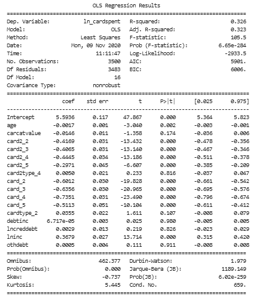
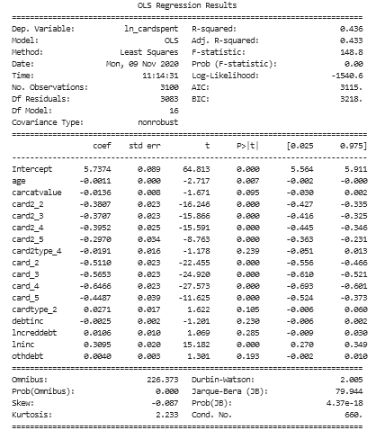

# Credit-card-linear-regression

<h2>Objective </h2>
The bank conducted survey of 5000 customers andcollected data. Objective is to understand what's driving the total spend(Primary Credit Card + Secondary Credit Card) of the customer. Given the factors, predict credit limit for the new applicants. 

<h4>ASSUMPTIONS</h4>

- No Multicollinearity
- No Heteroscedasticity 
- No Auto correlation
- Residual should be normally distributed

<h4>Data Analysis</h4>

The feature selection is done with the help of correlation matrix, f_regression method to infer the relation of each feature with the dependent variables. 

VIF ( Variance Inflation Factor ) is used to infer the relation of the independent variable with each other.

<h4>Modelling</h4>

The model need to have high R squared and the difference between R squared and the adjusted R squared as low as possible otherwise it will indicate multicollinearity in our model. 

<h2>First Linear Model Summary :</h2>

**Assumption** voilated :- Residual is not normally distributed.
There were some Influential Points that where affecting the parameter of the Model

<h2>Final Linear Model Summary :</h2>

After Removing those Influential Points and satisfying the **Assumption**.

<h2>Conclusion :</h2>
Linear regression is used to train the model. The following features were selected to train the model i.e. these features are driving the total spend of the customer is mentioned below:

 

**Feature that affecting total spend of Customers**

- **age** : _Age in years_ 
- **carcatvalue** : _Primary vehicle price category_
- **card2** : _Secondary credit card_ (eg. Visa / Master Card)
- **card2type** : _Designation of secondary credit card_ (eg. Gold / Silver / Bronze )
- **card** : _Primary credit card_ (eg. Visa / Master Card)
- **cardtype** : _Designation of primary credit card_ (eg. Gold / Silver / Bronze )
- **debtinc** : _Debt to income ratio_ (x100)
- **lncreddebt** : _Log-credit card debt_
- **lninc** : _Log-income_
- **othdebt** : _Other debt in thousands_

